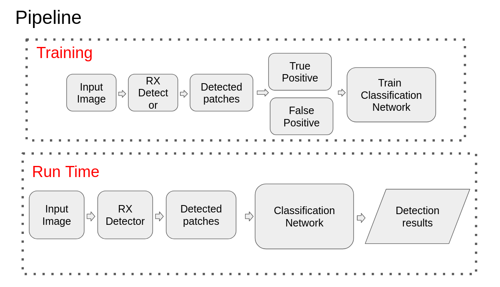

# Kaseya's Submission

This repo contains Kaseya's code and results for attempting 2023 Eagle Eyes Hackathon.

# Approach

With the observation that the base RX detector creates a lot of false detections based on local pixel statistics, I hypothesize that we could train a classification network based on the detected results of RX detector. This hypothesis relies on two prerequisites: 1. the RX detector can create a set of data points that should always include ground truth - based on visual inspection on datasets, it is true. 2. The set of data points detected by RX detector should be somewhat consistent in terms of object size and should contain recognizable features – tested while training the network, the classifier converges works ok, which proves this to be true.

The pipeline is displayed below: 


# Environment

```
    conda create -n eagle_eyes_hackathon python=3.10
    conda activate eagle_eyes_hackathon
    pip install -r requirements.txt
```

# Dataset Prep
The dataset was provided by hackathon organized with EagleEyes. They specilize in wild searching technologies to save lives, check them out here: https://www.eagleeyessearch.com/. 

The cropping code needs the original dataset and the json file with ground truth, refer to the main branch for downloading the dataset. crop/crop_background_images.py creates all the false positive background images (RX detected images – ground truth). crop/crop_groundtruth_images.py creates all the true positives (ground truth humans or objects). The finished crop set is in the folder eagle separated into training and validation by 8:2 ratio.

# Training
I perform transfer learning on Resnet18 and Resnet50. 
Change the following paramters to fit your needs:
model_name: output model name
first_stage_epoch: training while freezing all pre-trained layers
second_stage_epoch:Unfreeze all the layers and fine-tune with a couple more epochs

I used comet-ml for logging data, change the api_key, project_name, and workspace in experiment = Experiment(api_key="...", project_name="...", workspace="...")

```
python train_comet.py
```

# Inference
Some test samples are in the folder /test
Run 
```
python inference_folder.py
``` 
to inference on all the images in a folder

Or Run 
```
python inference.py

``` 
to inference on a single image


